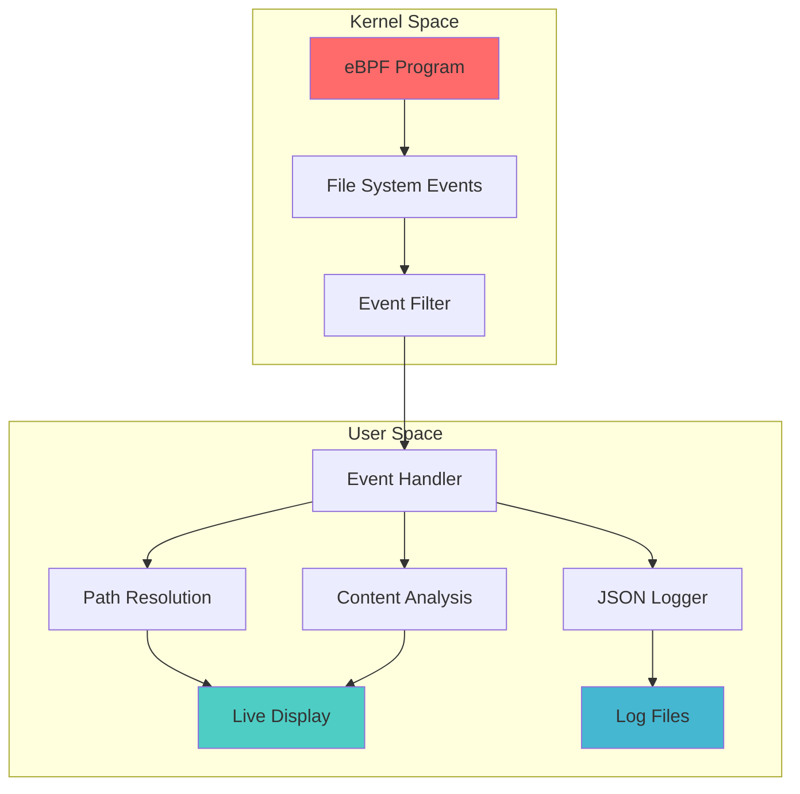

<div align="center">

# 🛡️ FIM - File Integrity Monitoring

### **Real-time File System Monitoring with eBPF Technology**

[](https://kernel.org)
[](https://ebpf.io)
[](<https://en.wikipedia.org/wiki/C_(programming_language)>)
[](https://kernel.org)

**High-performance, kernel-space file integrity monitoring system leveraging eBPF for real-time security monitoring with minimal overhead.**

[🚀 Quick Start](#-quick-start) • [📖 Features](#-key-features) • [⚡ Performance](#-performance) • [🛠️ Installation](#-installation) • [📊 Examples](#-usage-examples)

</div>

## 🌟 **Why FIM?**

<div align="center">

|                  🚀 **High Performance**                   |                   🛡️ **Security First**                   |       🎯 **Precision Monitoring**       |
| :--------------------------------------------------------: | :-------------------------------------------------------: | :-------------------------------------: |
| eBPF kernel-space monitoring<br/>**~minimal CPU overhead** | Real-time threat detection<br/>**Content-aware analysis** | Smart filtering & pattern matching<br/> |

</div>

---

## ✨ **Key Features**

### 🔍 **Core Monitoring Capabilities**

- **⚡ Real-time Events**: Monitor file creation, deletion, modification, symlink creation and permission changes with microsecond precision
- **🧠 Content-Aware**: Hash-based verification to detect actual content changes
- **👤 Process Context**: Track which processes are making file system changes
- **🔐 User Attribution**: Monitor file operations by specific users or system-wide

### 🎛️ **Advanced Filtering Engine**

- **🎯 Pattern Matching**: Include/exclude files based on glob patterns
- **🧹 Noise Reduction**: Intelligent filtering of temporary files and editor artifacts
- **📁 Path Controls**: Exclude specific directories or file types
- **⚙️ Process Filtering**: Monitor specific processes or exclude system noise

### 📊 **Rich Output & Logging**

- **📋 JSON Logging**: Structured logging with detailed event metadata
- **📺 Live Display**: Real-time monitoring with configurable output formats
- **📈 Metadata Capture**: File permissions, ownership, size, and timestamps
- **🏷️ Event Classification**: Categorize events by type (CREATE, DELETE, WRITE, RENAME/MOVE, SYMLINK, CHMOD, CHOWN)

### ⚡ **Performance Optimized**

- **🚀 eBPF Integration**: Minimal overhead monitoring directly in kernel space
- **💾 Smart Caching**: Avoid redundant checks for unchanged files
- **🎚️ Selective Monitoring**: Configure exactly what events to capture

---

## 🏗️ **Architecture Overview**

<div align="center">



</div>

### 🧩 **Core Components**

| Component                  | Description               | Purpose                                        |
| -------------------------- | ------------------------- | ---------------------------------------------- |
| **🔧 eBPF Kernel Program** | Runs in kernel space      | Capture file system events with zero overhead  |
| **⚡ Event Handler**       | Process and filter events | Apply intelligent filtering and categorization |
| **🗂️ Path Resolution**     | Resolve file paths        | Handle complex directory structures            |
| **📊 JSON Logger**         | Structured logging        | Comprehensive event metadata storage           |
| **🔍 File Monitor**        | Content analysis          | Hash-based change detection                    |
| **💻 System Info**         | Context capture           | System metadata (hostname, user, network)      |

---

## 🛠️ **Installation**

### 📋 **Prerequisites**

<details>
<summary><b>🐧 System Requirements</b></summary>

- Linux kernel **5.8+** with eBPF support
- Root privileges (required for eBPF program loading)
- BTF (BPF Type Format) support in kernel

</details>

<details>
<summary><b>📦 Dependencies Installation</b></summary>

**Ubuntu/Debian:**

```bash
sudo apt update && sudo apt install -y \
    libbpf-dev libelf-dev zlib1g-dev libssl-dev \
    bpftool clang gcc linux-headers-$(uname -r)
```

**RHEL/CentOS/Fedora:**

```bash
sudo dnf install -y \
    libbpf-devel elfutils-libelf-devel zlib-devel \
    openssl-devel bpftool clang gcc kernel-headers
```

</details>

### 🚀 **Quick Installation**

```bash
# 1️⃣ Clone the repository
git clone https://github.com/your-username/fim.git
cd fim

# 2️⃣ Verify dependencies
make check-deps

# 3️⃣ Build FIM
make

# 4️⃣ Install system-wide (optional)
sudo make install
```

### 🎯 **Build Options**

| Command           | Description              |
| ----------------- | ------------------------ |
| `make`            | 🔨 Standard build        |
| `make clean`      | 🧹 Clean build artifacts |
| `make check-deps` | ✅ Verify dependencies   |

---

## 🚀 **Quick Start**

```bash
# 🔍 Basic monitoring (requires root)
sudo ./fim

# 📊 Verbose output with timestamps
sudo ./fim --verbose --timestamp

# 🎯 Monitor specific directories
sudo ./fim --watch "/etc/*" --watch "/home/user/*"

# 🧹 Filter out noise
sudo ./fim --exclude-tmp-files --exclude-editor-noise
```

---

## 📚 **Usage Examples**

### 🛡️ **Security Monitoring**

```bash
# Monitor critical system directories
sudo ./fim --watch "/etc/*" --watch "/usr/bin/*" --watch "/usr/sbin/*" \
           --content-aware --enable-logging --timestamp
```

### 👨‍💻 **Development Environment**

```bash
# Monitor project with noise reduction
sudo ./fim --watch "/path/to/project/*" \
           --exclude-tmp-files --exclude-editor-noise \
           --ignore-unchanged --verbose
```

### 📋 **Compliance & Auditing**

```bash
# Comprehensive monitoring with logging
sudo ./fim --monitor-create --monitor-delete --monitor-write \
           --content-aware --enable-logging --timestamp --print-uid
```

### 🔧 **Configuration Options**

<details>
<summary><b>⚙️ Monitoring Control</b></summary>

- `--monitor-create` - Monitor file creation events
- `--monitor-delete` - Monitor file deletion events
- `--monitor-write` - Monitor file write/modification events
- `--strict-watch` - Only monitor explicitly specified patterns

</details>

<details>
<summary><b>🎛️ Filtering Options</b></summary>

- `--exclude <pattern>` - Exclude files matching pattern
- `--watch <pattern>` - Only monitor files matching pattern
- `--exclude-tmp-files` - Skip temporary files
- `--exclude-editor-noise` - Filter editor temporary files
- `--exclude-dev-null` - Skip /dev/null operations

</details>

<details>
<summary><b>📊 Output Options</b></summary>

- `--verbose` - Detailed event information
- `--timestamp` - Include event timestamps
- `--print-uid` - Show user IDs
- `--enable-logging` - Write events to `/var/log/fim.log`
- `--show-flags` - Display file operation flags
</details>

---

## 📊 **Output Formats**

### 🖥️ **Console Display**

```
TIME       EVENT    PID    USER     PATH                           DETAILS
14:30:15   CREATE   1234   alice    /home/alice/document.txt      [flags: O_WRONLY|O_CREAT]
14:30:16   WRITE     1234   alice    /home/alice/document.txt      [content changed]
14:30:20   DELETE   1234   alice    /tmp/temp_file.tmp
```

### 📋 **JSON Log Format**

````json
{
  "account": "root",
  "asset": "test-ubuntu",
  "asset_address": "192.168.17.148",
  "asset_os_family": "linux",
  "file_event": "other",
  "file_extension": "log",
  "file_name": "audit.log",
  "file_owner": "root",
  "file_path": "/var/log/audit/audit.log",
  "file_permissions": "rw-r-----",
  "file_size": 2039,
  "process": "auditd",
  "process_id": "750",
  "process_path": "/usr/sbin/auditd",
  "process_user": "root",
  "timestamp": "2025-07-08T15:20:16.000Z",
  "user": "root"
}
```

---

## ⚡ **Performance**

<div align="center">

| Metric                | Performance                                |
| --------------------- | ------------------------------------------ |
| **🔥 CPU Overhead**   | ~0.5-1% in typical scenarios               |
| **💾 Memory Usage**   | Efficient caching with configurable limits |
| **💽 Storage Impact** | Zero additional I/O for monitoring         |
| **📈 Scalability**    | Handles high-volume operations efficiently |

</div>

---

## 🔒 **Security Considerations**

| ⚠️ **Security Notes**                                     |
| --------------------------------------------------------- |
| • Requires root privileges for eBPF program loading       |
| • Monitor access to the FIM binary and configuration      |
| • Log files contain sensitive file system information     |

---

## 🐛 **Troubleshooting**

<details>
<summary><b>❌ Common Issues</b></summary>

| Issue                           | Solution                                        |
| ------------------------------- | ----------------------------------------------- |
| **Permission Denied**           | Ensure running with root privileges             |
| **eBPF Program Loading Failed** | Verify kernel eBPF support and BTF availability |
| **Missing Dependencies**        | Run `make check-deps` to verify installation    |

</details>

<details>
<summary><b>🔧 Debug Mode</b></summary>

```bash
# Build and run in debug mode
make debug
sudo ./fim --verbose
````

</details>

---
